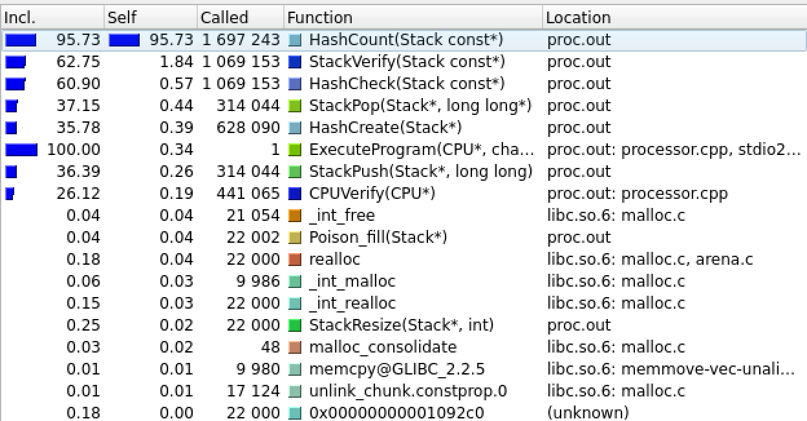
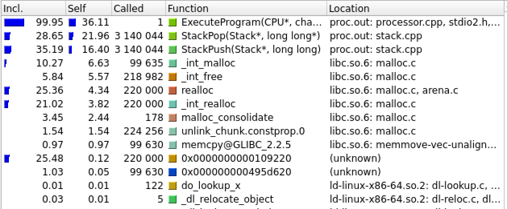
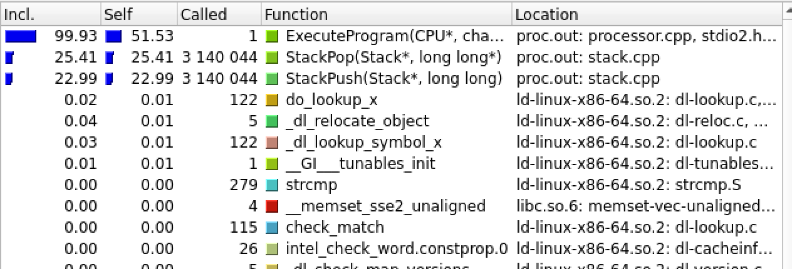

# Компилятор для FAIRYTALE LANGUAGE

## Синтаксис языка

### Функции

- `once upon the time()` - объявление главной функции (без аргументов)
- `fairytale(...)` - объявление остальных функций (не более 6 аргументов). Необходимы прототипы перед главной функцией
- `end(...)`- возврат из функции. Возвращаемое значение может быть переменной, выражением, константой или отсутствовать.
- вызов функции осуществляется указанием ее имени и аргументов (при наличии) в круглых скобках. Аргументы могут переменными, выражениями,  константами или отсутствовать.

### Математические операторы

- `+`, `-`, `*`, `/`, `sin`, `cos`, `^`, `ln`, `sqrt` - имеют стандартное значение

### Логические операторы

- `turned into` $\sim$ ==
- `did not turn into` $\sim$ !=
- `stronger` $\sim$ >
- `not stronger` $\sim$ <=
- `weaker` $\sim$ <
- `not weaker` $\sim$ >=
- `not true {expression}` $\sim$ !{expression}

### Присваивание

- `turn into` $\sim$ =. Присваивание в переменную значения. Пример использования
    ```
        fairytale character prince turn into 10;
    ```
    `fairytale character` - необязательная конструкция, служит для оформления языка в виде сказки

### Условные конструкции
- `stone` $\sim$ if. Пример использования
    ```
        stone (a stronger b)
            go right {
                a turn into a - 1;
            }
            go left {
                b turn into b - 1;
            }
    ```
- `fell into a dead sleep until` $\sim$ while. Пример использования
    ```
       fell into a dead sleep until (a weaker b) {
            a turn into a + 1;
       }
    ```

### Ввод и вывод

- `say the magic number()` - вывод константы или переменной, указанной в круглых скобках
- `say the magic word()` - вывод строки, указанной в двойных кавычках в круглых скобках
- `guess the riddle()` - запись значения с клавиатуры в переменную, указанную в круглых скобках

## Компилятор

Для языка был написан компилятор `g--` с возможностью компиляции для [виртуального процессора](https://github.com/1progwriter1/Calculator_CPU) и для `intel_x86_64`.

### Сбора компилятора

**Клонируйте репозиторий и переходите в папку с ним**

```sh
    git clone https://github.com/1progwriter1/MyLanguage.git && cd MyLanguage
```

**Соберите исходники**

```sh
    make front && make back && make intel && make mid
```

**Сделайте исполняемым скрипт `g--`**

```sh
    chmod +x g--.sh
```

**Для компиляции под виртуальный процессор необходимо в папку `my_g--` поместить скомпилированную программу `asm.out` [отсюда](https://github.com/1progwriter1/Calculator_CPU)**

### Запуск

```sh
    ./g--.sh [file] [arguments]
```
**Аргументы**
- [file] - компилируемый файл
- [arguments] -  `-mout` для компиляции под виртуальный процессор, без аргументов для компиляции под `intel_x86_64`

**Компилятор создаст папку `{file}.data` и поместит в ней отладочную информацию.**
- при компиляции для `intel_x86_64` будет создан одноименный файл с расширение *.out, который можно запустить стандартным способом.
- при компиляции для виртуально процессора будет создан одноименный файл с расширением *.mout, для запуска которого нужно использовать скомпилированную программу `proc.out` [отсюда](https://github.com/1progwriter1/Calculator_CPU).

### Сравнение времени работы программ, скомпилированных для разных архитектур

Для тестирования была написана [программа](test.fly) многократного расчета факториала. \
Все измерения проводятся при помощи консольной утилиты `time`, приведено усредненное время после троекратного измерения.

**Первое измерение**

Виртуальный процессор оказался медленнее в 15000 раз. Чтобы понять причину такой колоссальной разницы был получен временной профиль программы.

<figure>

</figure>

Большую часть времени занимает функция расчета хеша для верификации стека. Уберем эту функцию. Помимо этого отключим `assert()`, отключим верификацию.

**Второе измерение**

Результаты:
- `intel_x86_64`: 0,312 сек.
- виртуальный процессор: 28,187 сек.

Разница примерно в 90 раз. Получим еще раз временной профиль.

<figure>

</figure>

Видим, что очень часто вызывается `realloc`. Чтобы этого избежать, увеличим минимальный размер стека с 8 до 32.

**Третье измерение**

Результаты:
- `intel_x86_64`: 0,312 сек.
- виртуальный процессор: 20,213 сек.

Разница примерно 6,7 раза. Получим еще раз временной профиль программы, чтобы удостовериться, что больше ничего не замедляет работу процессора.

<figure>

</figure>

### Итоговы результат: Ускорение в 6,7 раза.